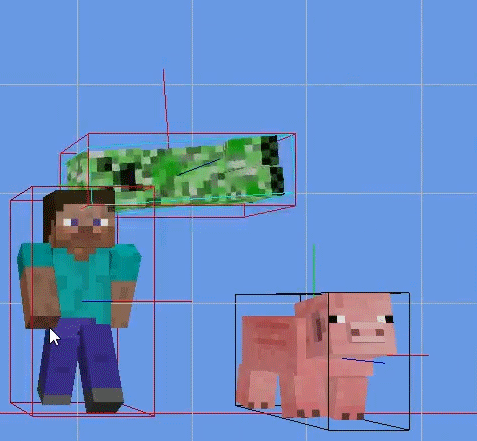

# SeparateAxisTheory

A project that uses separate axis theorem to determine if there is a collision between two objects using box colliders.

Later a free running project was made based on this method of collision detection. It can be found [here](https://github.com/AngelOfSol/freerunner-dsa2).

